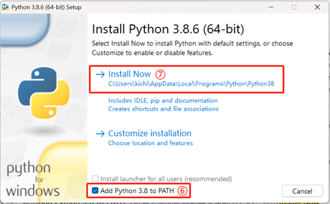
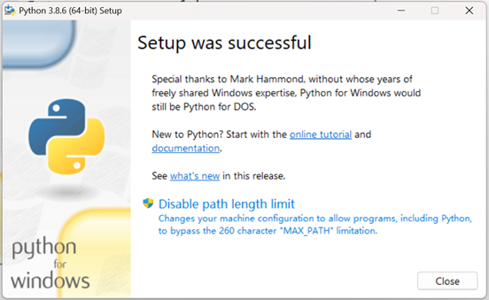
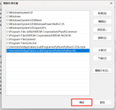

# AI通识课-编程助手学编程-安装

## Step 1：配置python环境
1. **进入python下载官网**
   - 网址：https://www.python.org/，选择Downloads，然后选择ALL releases。
   
2. **选择Python版本**
   - 下拉页面至Looking for a specific release，选择3.8.6，点击Download。
   
3. **选择安装文件**
   - 下拉页面至Files，点击Windows x86 - 64 executable installer。
   
4. **安装Python**
   - 打开下载的文件，勾选Add Python 3.8 to PATH，点击Install Now。
   
5. **完成安装**
   - 剩下的都点击Next，直至安装完成。
   
6. **验证安装**
   - 完成后在搜索中输入cmd调出命令行，输入Python即可进入Python环境。
   ：

### 若报错（未勾选Add Python 3.8 to PATH），需手动配置环境变量
1. **确认Python安装位置**
   - 在搜索中输入Python，
   
2. **右键，选择打开文件位置，选择Python 3.8 (64 - bit)，右键，选择属性，在起始位置中复制这个路径。**
   
   
   
3. **打开高级系统设置**
   - 在搜索中输入高级系统设置，双击打开，选择环境变量，在系统变量中选择Path，再选择编辑。
   
   
4. **添加路径**
   - 选择新建，粘贴刚刚复制的路径，选择确定，再选择确认。
   
   
   
5. **验证安装**
   - 完成后在搜索中输入cmd调出命令行，输入Python即可进入Python环境。
   

## Step 2：安装pandas、numpy、matplotlib库
1. **查看当前pip源**
   - 在搜索中输入cmd调出命令行，输入pip config get global.index - url。
   
2. **升级pip**
   - 输入python - m pip install --upgrade pip。
   
3. **配置清华源**
   - 输入pip config set global.index - url https://mirrors.tuna.tsinghua.edu.cn/pypi/web/simple。
   
4. **验证清华源配置**
   - 输入pip config get global.index - url，若为https://mirrors.tuna.tsinghua.edu.cn/pypi/web/simple，则成功。
   
5. **下载pandas库**
   - 输入pip install pandas - i https://pypi.tuna.tsinghua.edu.cn/simple。
   
6. **下载numpy库**
   - 输入pip install numpy - i https://pypi.tuna.tsinghua.edu.cn/simple。
   
7. **下载matplotlib库**
   - 输入pip install matplotlib - i https://pypi.tuna.tsinghua.edu.cn/simple。
   

## Step 3：搭建VS Code + 豆包MarsCode环境
1. **注册豆包Marscode账号**
   - 进入豆包marscode官网（https://www.marscode.cn/home?utm_source=school&utm_medium=datawhale&utm_campaign=aix_sr），注册账号，对应填写即可。
   
   
   
   
2. **安装豆包Marscode**
   - 点击立即获取编程助手、点击前往下载、选择对应系统，然后一直点击下一步即可安装完成。
   
3. **在VS Code中安装Marscode插件**
   - 打开Visual Studio Code插件市场，搜索Marscode，点击安装，安装完成后重启Visual Studio Code，重启成功后登录账号，从左边栏找到豆包Marscode，即可体验AI助力编程。
   
