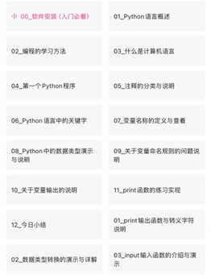
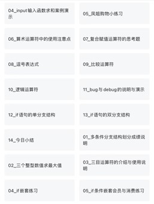
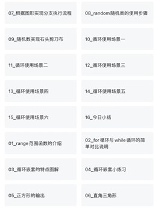
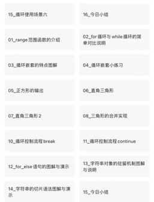

# AI通识课-编程课-快速了解要学习的内容和拆解的大纲（3）

## 前言
郑重声明：本教程为纯开源内容，不接任何广告木也不接任何推广，所有提及的书籍与课程只做示例示范！

我们在确定了学习路线之后，需要做的就是根据我们的实际需要，来生成我们需要的学习内容，以此来满足我们的具体需求。

本篇文档以python为示例，来向大家分享。本篇文章会保留编程助手的输出内容，以便大家更直观的查看其里面的内容。

## 1.了解编程语言
对于一个陌生的编程语言，我们要做的应该是了解一下它，看看它一般用在哪里，这样子我们的心里会有个底，根据实际情况来决定我们学多少，学多深。所以我们的第一步应该是问一下豆包，看看python语言在具体实际当中有哪些应用是我们所需要的。

接下来将会演示如何撰写prompt来更加全面的了解我们将要学习到的编程语言。
### prompt写法：
1. 指明编程语言
2. 需要了解的具体方面（如实际应用，工程应用，软件开发，数据分析等具体的使用场景）

### prompt：请介绍一下python语言以及其在实际场景中的应用

**输出：**
Python是一种高级、通用、解释型的编程语言，由Guido van Rossum于1989年创建，并于1991年首次发布。Python的设计哲学强调代码的可读性和简洁性，其语法清晰且易于理解，这使得Python成为了许多开发者的首选语言。

### 一.Python语言具有以下特点：
1. 简单易学：Python的语法简洁明了，容易上手，适合初学者。
2. 可读性强：Python的代码结构清晰，易于阅读和维护。
3. 跨平台性：Python可以在多种操作系统上运行，如Windows、Mac OS和Linux。
4. 丰富的库和框架：Python拥有大量的第三方库和框架，如NumPy、Pandas、Matplotlib等，这些库和框架可以帮助开发者快速构建各种应用程序。
5. 面向对象：Python支持面向对象编程，可以方便地创建和使用类和对象。
6. 解释型语言：Python代码在运行前不需要编译，可以直接运行，这使得开发和调试过程更加便捷。

### 二.Python在实际场景中的应用非常广泛，以下是一些常见的应用领域：
1. Web开发：Python可以用于构建Web应用程序，如Django和Flask等框架可以帮助开发者快速构建高效的Web服务。
2. 数据分析：Python拥有强大的数据分析库，如NumPy、Pandas和Matplotlib等，这些库可以帮助数据分析师和科学家处理和分析大量数据。
3. 人工智能：Python在人工智能领域也有着广泛的应用，如TensorFlow和PyTorch等库可以帮助开发者构建和训练机器学习模型。
4. 自动化运维：Python可以用于编写自动化脚本，帮助系统管理员管理和维护服务器。
5. 游戏开发：Python也可以用于游戏开发，如Pygame等库可以帮助开发者快速构建2D游戏。

总之，Python是一种功能强大、应用广泛的编程语言，无论是初学者还是专业开发者，都可以从Python中受益。

在阅读我们需要的资料之后，我们将确定，这门语言就是我们所需要学习的编程语言，我们才开始认真学习。减少了遇到同名的情况所带来的信息干扰，节约学习时候的注意力。

在了解编程语言的内容以及其的应用领域是我们所需要的，这时候我们将继续学习定制我们所需要的大纲。

## 2.生成需要的教学大纲
接下来，我们将通过两个示例，来表现不同基础的学习者，如何编写合适的prompt，生成更加符合自己实际情况的学习大纲，来更好的贴合我们的实际情况。

### 示例一：编程小白
**prompt写法：**
1. 介绍自己的编程基础
2. 想要学习的编程语言
3. 掌握编程语言的程度
4. 说明想要得到的内容（如：大纲示例，详细的大纲等）

**prompt1（初学者）：我是一位python小白，想要初步掌握python内容，能给我一个大纲示例吗？**

**回答：**
当然可以！以下是一个Python学习的大纲示例，涵盖了从基础到进阶的内容。你可以根据自己的学习进度逐步深入学习。

#### 一、Python基础
1. 变量和数据类型
    1.1变量的定义和命名规则
    1.2常见的数据类型：整数、浮点数、字符串、布尔值等
    1.3数据类型的转换
2. 运算符和表达式
    1.2算术运算符、比较运算符、逻辑运算符等
    1.2运算符的优先级
3. 条件语句
    1.1.if语句
    1.2.if-else语句
    1.3.if-elif-else语句
    1.4.嵌套条件语句
4. 循环语句
    1.1.while循环
    1.2.for循环
    1.3.break和continue语句
    1.4.嵌套循环
5. 函数
    1.1.函数的定义和调用
    1.2.参数传递：位置参数、默认参数、关键字参数、可变参数
    1.3.返回值
    1.4.函数的嵌套和递归
6. 模块和包
    1.1.模块的导入和使用
    1.2.自定义模块
    1.3.包的概念和使用

#### 二、Python数据结构
1. 列表（List）
    1.1.列表的创建、访问、修改和删除
    1.2.并行列的遍历
    1.3.列表的排序和反转
    1.4.列表的嵌套
2. 元组（Tuple）
    1.1.元组的创建、访问和修改
    1.2.元组的遍历
    1.3.元组与列表的区别
3. 字典（Dictionary）
    1.1.字典的创建、访问、修改和删除
    1.2.字典的遍历
    1.3.字典的嵌套
4. 集合（Set）
    1.1.集合的创建、访问、修改和删除
    1.2.集合的遍历
    1.3.集合的运算：并集、交集、差集

#### 三、Python高级特性
1. 面向对象编程（OOP）
    1.1.类和对象的概念
    1.2.类的定义和实例化
    1.3.继承、封装和多态
    1.4.类的特殊方法
2. 文件操作
    1.1.文件的打开、读取、写入和关闭
    1.2.文件的处理模式：文本模式和二进制模式
    1.3.文件的遍历和处理
3. 异常处理
    1.1.异常的概念和类型
    1.2.try-except语句的使用
    1.3.异常的捕获和处理
4. 正则表达式
    1.1.正则表达式的基本语法
    1.2.re模块的使用
    1.3.正则表达式的应用

#### 四、Python库和框架
1. NumPy
    1.1.NumPy数组的创建、操作和运算
    1.2.NumPy的数学、逻辑、形状操作等函数
    1.3.NumPy的广播机制
2. Pandas
    1.1.Pandas数据结构：Series和DataFrame
    1.2.数据的读取、写入和处理
    1.2.数据清洗、转换和聚合
    1.3.数据索引和切片
3. Matplotlib
    1.1.绘图基础：线条、点、柱状图等
    1.2.图形的定制和美化
    1.3.子图和多个图形的绘制
4. Scikit-learn
    1.1.机器学习基础：数据预处理、模型选择和评估
    1.2.常见的机器学习算法：线性回归、逻辑回归、决策树等
    1.3.模型的训练和预测

#### 五、Python项目实践
1. 小项目实践
    1.1.选择一个感兴趣的小项目，如数据分析、爬虫、游戏等
    1.2.按照项目需求，设计和实现代码
    1.3.调试和优化代码
2. 团队项目实践
    1.1.参与团队项目，学习团队协作和代码管理
    1.2.实践版本控制工具，如Git
    1.3.提高代码质量和可维护性

通过以上的学习大纲，你可以系统地学习Python编程，并逐步提升自己的编程能力。记得多做练习和实践，这样才能更好地掌握Python。祝你学习愉快！

对于小白来说，我们可能会感觉对生成的内容有点不相信，会不会AI的学习内容增加了？会不会模型更新跟不上时代，还保留了一些旧版本的东西？学的东西会不会落伍？接下来正好与大家说明如何正确处理的AI的学习大纲。

我们首先来看一下b站的python入门课程教学截图，对比生成课程内容中的python基础模块。剩下的模块交由大家自行验证。

课程链接：https://www.bilibili.com/video/BV13e411172J/?spm_id_from=333.337.search-card.all.click&vd_source=dfc0a2d802e8ea2a5fe6dfd7c78ea66c

   
   
   
   

通过对比，我们发现，大纲中的python基础需要有的内容也会有，至于课程当中的练习题，我们将会在后续的章节中具体学习到。

这里我们还会发现，大纲中的基础内容与视频课的内容对比，还多了一节包的概念。作为零基础的小白，可能不知道包是什么东西，需不需要学。这里将教会大家，在了解到别人没有该内容时，编程助手继续生成了多余的相关内容，要如何处理。

对于这种情况来说，有两种处理方法：
1. 找更多的相关资料or询问更有经验的人，查看内容是否该学
2. 选择跳过生成的内容，后续遇到相关情况，再来学习，打上这一块补丁。（如包没学，后面需要用到包的知识，我们再通过编程助手将相关内容补全。）

对于编程助手生成的大纲，这里有一个小tips：专业的知识中，编程助手是专业的，可信，建议方面，编程助手是半脱离实际的，仅供参考，大家可以根据具体情况，对编程助手提的建议进行适当删改~！

### 示例二：有编程基础但需要python数据分析技能需求的学习者
**prompt写法：**
1. 说明自己的编程基础
2. 想要学习or掌握的技能
3. 具体的表达为想得到的操作，这里的具体操作可能不准确，猜测作者想表达的是具体的输出形式（如大纲，详细的大纲等）

**prompt2：我有python基础，想要学习数据分析，能给我一份详细的学习大纲吗？**

**回答：**
当然可以！以下是一份详细的Python数据分析学习大纲，涵盖了从基础到进阶的内容，帮助你逐步掌握数据分析的技能。

#### 一、Python基础
1. Python语法：变量、数据类型、条件语句、循环语句、函数等。
2. 数据结构：列表、元组、字典、集合等。
3. 文件操作：读取和写入文件。

#### 二、数据处理与分析
1. NumPy：数组操作、数学、逻辑、形状操作、排序、选择、输入输出、离散傅里叶变换、基本线性代数、基本统计操作等。
2. Pandas：数据结构（Series和DataFrame）、数据操作、数据清洗、数据聚合、数据重塑、时间序列处理等。
3. Matplotlib：绘图基础、线条图、散点图、柱状图、直方图、饼图等。
4. Seaborn：高级绘图、统计图形、数据分布可视化等。

#### 三、数据预处理
1. 数据清洗：处理缺失值、异常值、重复值等。
2. 数据转换：数据类型转换、数据归一化、数据标准化等。
3. 特征工程：特征选择、特征提取、特征构建等。

#### 四、数据分析与建模
1. 统计学基础：描述性统计、概率分布、假设检验、回归分析等。
2. 机器学习基础：监督学习、无监督学习、半监督学习、强化学习等。
3. 常用算法：线性回归、逻辑回归、决策树、随机森林、支持向量机、聚类算法等。

#### 五、实践项目
1. 通过实际项目，应用所学知识，解决数据分析问题。

#### 六、进阶学习
1. 深度学习：神经网络、卷积神经网络、循环神经网络等。
2. 大数据处理：Hadoop、Spark等。
3. 数据可视化：Tableau、Power BI等。

**学习资源推荐**
1. **书籍：**
    - 《Python for Data Analysis》
    - 《Data Science from Scratch》
    - 《Hands-On Machine Learning with Scikit-Learn, Keras, and TensorFlow》
2. **在线课程：**
    - Coursera: "Python for Data Science and Machine Learning Bootcamp"
    - Udemy: "Python for Data Science and Machine Learning Bootcamp"
    - edX: "Introduction to Data Science in Python"
3. **网站和博客：**
    - Stack Overflow
    - Kaggle
    - Towards Data Science

**学习建议**
1. 实践为王：多做项目，多写代码，通过实践加深理解。
2. 持续学习：数据分析领域发展迅速，保持学习状态，不断更新知识。
3. 交流分享：加入数据分析社区，与他人交流分享，共同进步。

希望这份学习大纲能帮助你系统地学习Python数据分析，祝你学习顺利！

这一份我们可以明显看到，在说明有python编程基础后，python基础内容减少许多，增加的是关于数据分析的众多库，这里的内容验证与示例一相同，将不重复赘述。

值得强调的是，这里多了许多学习资源的推荐。这里需要对编程助手生成的学习资源进行说明。

学习资源中的网站基本是外国网站，容易有进不去的问题，所以这里不推荐大家通过其获得学习资源。至于如何处理这些推荐的外教课程，将会在课程后教会大家处理办法。

推荐大家的是推荐的书籍，我们可以通过书籍来进行补充学习，如果担心外文版的看不懂，我们也可以使用其对应的中文翻译版来帮助我们学习。

说明：书籍为编程助手推荐，本教程不接任何广告木也不接任何图书推广，所有书籍只做示例示范

## 3.拆解大纲
在生成我们需要的学习大纲后，我们需要做到就是对其进行拆解，使其有一个完整的，合理的学习计划。

接下来跟大家分享如何对大纲进行拆解。

### prompt写法：
1. 说明拆解的对象
2. 拆解后希望的输出

### prompt：根据生成的python语言的学习大纲，对其拆解并给出合适的学习计划

**输出：**
根据您提供的Python语言学习大纲，以下是一个拆解后的学习计划，旨在帮助您系统地学习Python编程：

#### 学习计划：
##### 阶段一：Python基础
1. Python语法和数据类型
    1.1.学习Python的基本语法、变量、数据类型（整数、浮点数、字符串、列表、元组、字典等）。
    1.2.理解Python的缩进规则和代码块。
    1.3.控制流和循环
2. 学习条件语句（if - else）、循环语句（for、while）。
    2.1.掌握如何使用这些语句来控制程序的流程。
3. 函数和模块
    3.1.学习如何定义和调用函数。
    3.2.理解模块的概念，以及如何导入和使用模块。

##### 阶段二：数据结构和算法
1. 列表、元组和字典
    1.1.深入学习列表、元组和字典的操作和方法。
    1.2.掌握如何使用这些数据结构来存储和处理数据。
2. 字符串处理
    2.1.学习字符串的操作和方法，如字符串拼接、格式化、查找和替换等。
    2.2.文件操作
    2.3.了解如何读写文件，以及如何处理文件中的数据。

##### 阶段三：面向对象编程
1. 类和对象
    1.1.学习面向对象编程的基本概念，如类、对象、继承、多态等。
    1.2.掌握如何定义类和创建对象。
    1.3.封装、继承和多态
    深入理解面向对象编程的三大特性，并学会如何应用它们。

##### 阶段四：高级主题
1. 异常处理
    1.1.学习如何捕获和处理程序中的异常。
    1.2.理解异常处理的重要性，以及如何编写健壮的代码。
    1.3.正则表达式
    1.4.了解正则表达式的基本语法和用法。
    1.5.学会如何使用正则表达式来处理字符串。
2. 网络编程和数据库
    2.1学习网络编程的基本概念，如TCP/IP、HTTP等。
    2.2.了解如何使用Python进行数据库操作。

##### 阶段五：实践项目
1. 小项目实践
    1.1.通过实际项目来巩固所学知识。
    1.2.选择一些简单的项目，如计算器、待办事项列表、简单的游戏等。
2. 团队项目
    1.1.参与团队项目，学习如何与他人协作开发。
    1.2.选择一些中等规模的项目，如网站开发、数据分析等。

#### 学习资源：
1. **在线教程：**Codecademy、Coursera、edX等平台上有很多Python课程。
2. **书籍：**《Python编程从入门到实践》、《Python基础教程》等。
3. **社区：**加入Python社区，如Stack Overflow、Reddit的r/learnpython等，与其他学习者交流。

#### 学习时间安排：
1. 每天：至少安排1 - 2小时学习Python。
2. 每周：完成一个小项目，或者学习一个新的主题。
3. 每月：参与一个团队项目，或者复习之前学过的知识。

通过这个学习计划，您可以系统地学习Python编程，并逐步提高自己的编程能力。祝您学习愉快！

在拆解完大纲后，我们可以对每一个小点进行具体的内容学习，保证知识点的前后联系，确保不会在需要衔接的知识点断开，造成前面学后面忘的情况。

## 4.推荐图书以及资源补充
诚然，编程助手带给我们非常多的方便，但是毕竟还是一家之言，我们学习需要有多方面的参照来加强我们对一个知识点的多角度理解，所以找更多的学习资源来辅助我们学习，帮助我们生成独属于自己的代码风格是非常重要的。

下面以python语言为例，教会大家如何寻找学习资源。

### 推荐资源的prompt写法：
1. 指明学习的编程语言
2. 需要的具体内容（书籍，网课，经典题目等）

#### （1）推荐书籍
**prompt：学习python的时候有没有书籍推荐？**

**输出：**
当然有！以下是一些适合Python初学者的经典书籍推荐：
1. 《Python编程从入门到实践》
    作者：Eric Matthes
    简介：这本书分为两部分，第一部分介绍Python的基础知识，第二部分通过项目实践帮助读者巩固所学知识。
2. 《Python基础教程》
    作者：Magnus Lie Hetland
    简介：这本书内容全面，涵盖了Python的基础知识和高级主题，适合初学者和有一定编程基础的读者。
3. 《Python核心编程》
    作者：Wesley J. Chun
    简介：这本书深入讲解了Python的核心概念和高级特性，适合有一定编程基础的读者进一步提升Python技能。
4. 《流畅的Python》
    作者：Luciano Ramalho
    简介：这本书介绍了Python的高级用法和最佳实践，适合有一定Python基础的读者提高编程水平。
5. 《Python Cookbook》
    作者：David Beazley, Brian K. Jones
    简介：这本书提供了大量的Python编程技巧和实用代码示例，适合有一定编程基础的读者查阅和学习。

以上书籍都是Python学习的经典之作，你可以根据自己的学习进度和需求选择适合自己的书籍。希望这些推荐对你有所帮助！

#### （2）推荐课程资料
**prompt：学习python的时候有没有网课课程推荐？**

**输出：**
当然有！以下是一些受欢迎的Python网课课程推荐：
1. Coursera - Python for Everybody
    由密歇根大学提供的Python入门课程，适合初学者。
    课程内容包括Python基础、网络爬虫、数据处理等。
2. edX - Introduction to Python Programming
    由麻省理工学院提供的Python编程入门课程。
    课程内容涵盖Python语法、数据结构、函数、面向对象编程等。
3. Udemy - Python for Beginners
    这是一门广受欢迎的Python入门课程，适合零基础的学习者。
    课程内容包括Python基础、数据类型、控制流、函数、文件操作等。
4. Codecademy - Learn Python
    Codecademy提供的Python交互式学习课程，通过实践项目帮助学习者掌握Python编程。
    形质较相似，课程内容包括Python基础、数据结构、函数、面向对象编程等。
5. Pluralsight - Python Fundamentals
    这是一门全面的Python基础课程，适合想要系统学习Python的学习者。
    课程内容包括Python语法、数据类型、控制流、函数、模块、面向对象编程等。
6. MIT OpenCourseWare - Introduction to Computer Science and Programming in Python
    这是麻省理工学院提供的免费Python课程，适合有一定编程基础的学习者。
    课程内容包括Python基础、算法、数据结构、面向对象编程等。

以上课程都提供了高质量的教学内容和实践项目，可以帮助你系统地学习Python编程。你可以根据自己的学习需求和时间安排选择适合自己的课程。祝你学习愉快！

#### （3）推荐经典项目
**prompt：学习python的时候有没有经典代码题目和项目推荐？**

**输出：**
当然有！以下是一些经典的Python代码题目和项目推荐，适合不同水平的学习者：

##### 代码题目：
1. FizzBuzz
    编写一个程序，打印从1到100的数字。但对于3的倍数，打印“Fizz”而不是数字；对于5的倍数，打印“Buzz”；对于既是3的倍数又是5的倍数的数字，打印“FizzBuzz”。
2. 猜数字游戏
    编写一个猜数字游戏，程序随机生成一个1到100之间的数字，玩家需要猜测这个数字。如果猜测的数字太大，程序会提示“Too high”；如果猜测的数字太小，程序会提示“Too low”；如果猜测正确，
将在下一次迭代中添加更合适的建议。当前提供的建议可能并不完全准确，需要您自行根据实际情况进行调整。希望您能根据这些信息更好地理解和学习Python编程知识！如果您还有其他问题，请随时提问。

## 结语
在这一章当中，我们已经学会了如何规划学习内容，学习所需要的内容，以及如何寻找补充资料，那么，快去DIY独属于自己的学习计划吧~！ 
