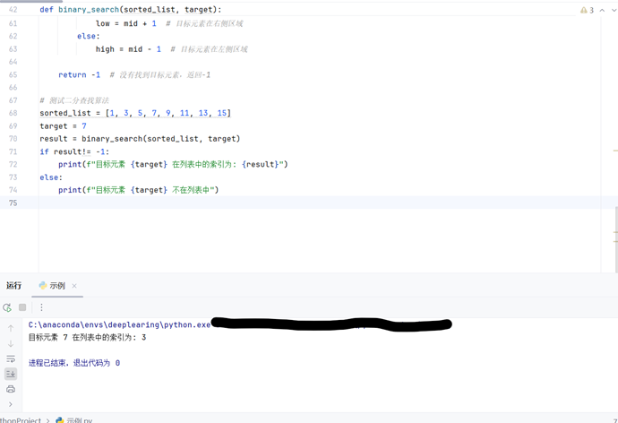

__AI通识课\-编程课\-通过网上优质的资料，快速习得有价值的案例和思路（6）__

__前言__

在前面的学习当中，我们具备学会了如何通过编程助手来学习一门编程语言。但是在学完之后我们会发现，似乎目前掌握的还是有点欠缺实战经验，相较于编程助手指导下固定的代码风格，我们在学习别的代码的时候，别人的代码风格可能与编程助手的截然不同，这时候我们需要学会利用编程助手，来辅助我们学习别人的代码。

在这一篇文章当中，我们将会学习到如何借助编程助手，学习网络上的优质资源。

__1\.寻找优秀资源__

这里的寻找优秀资源是对前面学习经典项目的一个补充，通过演示如何寻找学习，教会大家如何通过编程助手来学习网络上的优质资源。

我们可以利用编程助手做一个项目的筛选，先把经典的项目筛选出来，方便我们继续上网查询。

prompt写法：

（1）写明编程语言

（2）写明需要的内容（经典项目，经典题目等）

（3）输出内容的操作（详细，简略等）

prompt：在学习python过程中有哪些经典题目，经典项目推荐？请列出并且介绍。

输出：

在学习Python的过程中，有许多经典的题目和项目可以帮助你巩固知识、提高编程能力。以下是一些推荐：

经典题目：

1\.FizzBuzz：

问题：打印从1到100的数字，但如果数字是3的倍数，打印“Fizz”；如果是5的倍数，打印“Buzz”；如果是3和5的倍数，打印“FizzBuzz”。

解释：这个问题是编程入门的经典题目，它涉及到条件判断和循环。

2\.素数判断：

问题：判断一个给定的数是否为素数。

解释：这个问题可以帮助你理解循环和条件判断的使用，以及如何优化算法。

3\.汉诺塔：

问题：使用递归算法解决汉诺塔问题。

解释：汉诺塔问题是一个经典的递归问题，可以帮助你理解递归的概念和应用。

4\.排序算法：

问题：实现常见的排序算法，如冒泡排序、插入排序、选择排序、快速排序等。

解释：排序算法是编程中的基础，通过实现这些算法，你可以更好地理解算法的原理和性能。

5\.文件操作：

问题：读取一个文本文件，统计其中每个单词出现的次数，并将结果写入另一个文件。

解释：这个问题涉及到文件操作、字符串处理和数据结构的使用。

经典项目：

1\.Web爬虫：

项目：使用Python编写一个网络爬虫，从网页中提取数据。

解释：这个项目可以帮助你理解网络编程、HTML解析和数据处理。

2\.数据分析：

项目：使用Python进行数据分析，例如分析股票数据、天气数据等。

解释：这个项目可以帮助你理解数据处理、数据分析和数据可视化。

3\.游戏开发：

项目：使用Python和Pygame库开发一个简单的游戏。

解释：这个项目可以帮助你理解图形界面编程、游戏逻辑和事件处理。

4\.机器学习：

项目：使用Python和Scikit\-learn库进行简单的机器学习任务，如分类、回归等。

解释：这个项目可以帮助你理解机器学习的基本概念和算法。

5\.Web应用开发：

项目：使用Python和Flask或Django框架开发一个简单的Web应用。

解释：这个项目可以帮助你理解Web开发的基本概念、HTTP协议和数据库操作。

通过完成这些经典题目和项目，你可以更好地掌握Python编程，提高自己的编程能力和解决问题的能力。

当然，如果有自己实际需求的具体项目也是可以通过查询相关资料并且学习的。

__2\.学习优秀资源__

这里通过一个实际的例子来模拟：

（1）遇到看不懂的代码要如何在编程助手的帮助下阅读代码

（2）如何通过编程助手优化（学习，自己写的）代码

例子：排序算法

参考CSDN上的文章中的二分查找法，点击链接即可查看。

代码如下：

Pythondef binary\_search\(sorted\_list, target\):  
    low = 0  
    high = len\(sorted\_list\) \- 1  
  
    while low <= high:  
        mid = \(low \+ high\) // 2  
        if sorted\_list\[mid\] == target:  
            return mid  \# 找到目标元素，返回索引  
        elif sorted\_list\[mid\] < target:  
            low = mid \+ 1  \# 目标元素在右侧区域  
        else:  
            high = mid \- 1  \# 目标元素在左侧区域  
  
    return \-1  \# 没有找到目标元素，返回\-1  
  
\# 测试二分查找算法  
sorted\_list = \[1, 3, 5, 7, 9, 11, 13, 15\]  
target = 7  
result = binary\_search\(sorted\_list, target\)  
if result \!= \-1:  
    print\(f"目标元素 \{target\} 在列表中的索引为: \{result\}"\)  
else:  
    print\(f"目标元素 \{target\} 不在列表中"\)

我们学习的时候可以先让编程助手帮助我们解释一下代码实现逻辑。

prompt操作与写法：

（1）首先将代码放入编译环境，保证编程助手能够读取代码

（2）在编程助手写入操作：解释代码逻辑

prompt：解释一下代码逻辑。

注：此时已经将代码放置在编译器内，编程助手可以直接读取代码，如果没有插件读取功能的话可以使用语句：“请解释一下“放入你的解释代码”的代码逻辑”（括号内可以直接把需要解读的代码整块复制进去）

输出：

这段代码是一个二分查找算法的实现，用于在一个有序列表中查找目标元素。下面是代码的逐行解释：

def binary\_search\(sorted\_list, target\):：定义一个名为binary\_search的函数，它接受两个参数：一个有序列表sorted\_list和一个目标元素target。

low = 0：初始化变量low为0，表示查找范围的起始位置。

high = len\(sorted\_list\) \- 1：初始化变量high为有序列表长度减1，表示查找范围的结束位置。

while low <= high:：使用一个循环，只要low小于等于high，就继续执行循环体。

mid = \(low \+ high\) // 2：计算查找范围的中间位置mid，使用整数除法//确保结果为整数。

if sorted\_list\[mid\] == target:：如果中间位置的元素等于目标元素，则找到了目标元素，返回其索引mid。

elif sorted\_list\[mid\] < target:：如果中间位置的元素小于目标元素，则目标元素在右侧区域，更新low为mid \+ 1。

else:：如果中间位置的元素大于目标元素，则目标元素在左侧区域，更新high为mid \- 1。

return \-1：如果循环结束后仍未找到目标元素，则返回\-1表示目标元素不在列表中。

sorted\_list = \[1, 3, 5, 7, 9, 11, 13, 15\]：定义一个有序列表sorted\_list。

target = 7：定义目标元素target。

result = binary\_search\(sorted\_list, target\)：调用binary\_search函数，在有序列表sorted\_list中查找目标元素target，并将结果存储在result变量中。

if result\!= \-1:：如果查找结果不等于\-1，表示找到了目标元素。

print\(f"目标元素 \{target\} 在列表中的索引为: \{result\}"\)：打印找到的目标元素的索引。

else:：如果查找结果等于\-1，表示没有找到目标元素。

print\(f"目标元素 \{target\} 不在列表中"\)：打印目标元素不在列表中的信息。

总的来说，这段代码实现了二分查找算法，能够高效地在有序列表中查找目标元素，并返回其索引或表示未找到的信息。

此时我们再来看一下如果让编程助手所生成的代码

prompt写法：

（1）生成代码要求，不然编程助手会认为在已有的基础上优化

（2）代码要求（完整，简洁等）

（3）输出操作（正确一词可以确保没有生成伪代码）

prompt：不参考代码，请写出一段完整的二分查找法并且正确输出

注：不参考代码指的是不参考我们寻找的文章，让编程助手自行生成，这时候我们就会有两种样本进行对比学习参考。

输出：

当然，以下是一段完整的二分查找法的Python代码，包括注释和测试用例：

def binary\_search\(sorted\_list, target\):

    """

    在有序列表中查找目标元素，并返回其索引。如果未找到，返回\-1。

    参数:

    sorted\_list \(list\): 一个有序的列表。

    target \(int\): 要查找的目标元素。

    返回:

    int: 目标元素在列表中的索引，如果未找到，返回\-1。

    """

    low = 0

    high = len\(sorted\_list\) \- 1

    while low <= high:

        mid = \(low \+ high\) // 2

        if sorted\_list\[mid\] == target:

            return mid  \# 找到目标元素，返回索引

        elif sorted\_list\[mid\] < target:

            low = mid \+ 1  \# 目标元素在右侧区域

        else:

            high = mid \- 1  \# 目标元素在左侧区域

    return \-1  \# 没有找到目标元素，返回\-1

__测试二分查找算法__

sorted\_list = \[1, 3, 5, 7, 9, 11, 13, 15\]

target = 7

result = binary\_search\(sorted\_list, target\)

if result\!= \-1:

    print\(f"目标元素 \{target\} 在列表中的索引为: \{result\}"\)

else:

    print\(f"目标元素 \{target\} 不在列表中"\)

这段代码定义了一个名为binary\_search的函数，它接受一个有序列表和一个目标元素作为参数，并返回目标元素在列表中的索引。如果目标元素不在列表中，函数返回\-1。测试用例展示了如何使用这个函数，并输出查找结果。

输出截图：
    
可以看到代码正确输出。

__结语__

希望六篇教程能给大家在使用编程助手的时候有所启发~！
